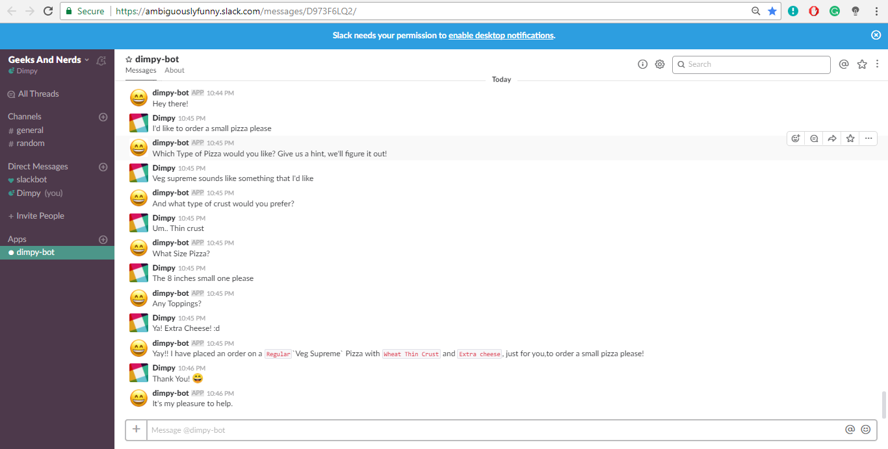
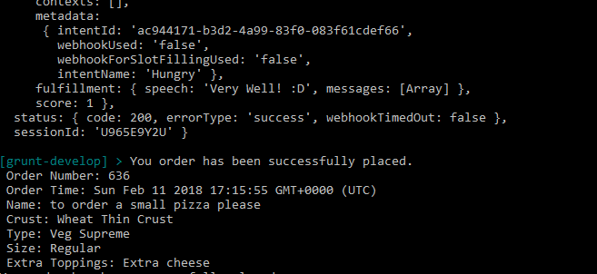

# 

# Pizza Bot

A bot built in Dialog Flow and connected with Node JS server to make a communication between customer and sending the order details to a REST Api
 
It was built in [Dialog Flow console.](https://dialogflow.com)

Connected to Slack with a Node JS server
[

Data as fetched out of the conversation was sent across to a REST API on amazon aws.  
[
